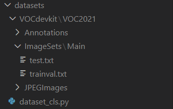

## Introduction

这是一个用于Windows训练YOLOX的项目，相比于官方项目，做了一些适配和修改：

1、解决了Windows下import yolox失败，No such file or directory: 'xxx.xml'等路径问题

2、CUDA out of memory等显存不够问题

3、增加eval.txt，可以输出IoU=0.5-0.95的AP值，以及Map50和Map50:95

## Benchmark

| Model                                       | size | mAP<sup>val<br>0.5:0.95 | mAP<sup>test<br>0.5:0.95 | Speed V100<br>(ms) | Params<br>(M) | FLOPs<br>(G) |                           weights                            |
| ------------------------------------------- | :--: | :---------------------: | :----------------------: | :----------------: | :-----------: | :----------: | :----------------------------------------------------------: |
| [YOLOX-s](./exps/default/yolox_s.py)        | 640  |          40.5           |           40.5           |        9.8         |      9.0      |     26.8     | [github](https://github.com/Megvii-BaseDetection/YOLOX/releases/download/0.1.1rc0/yolox_s.pth) |
| [YOLOX-m](./exps/default/yolox_m.py)        | 640  |          46.9           |           47.2           |        12.3        |     25.3      |     73.8     | [github](https://github.com/Megvii-BaseDetection/YOLOX/releases/download/0.1.1rc0/yolox_m.pth) |
| [YOLOX-l](./exps/default/yolox_l.py)        | 640  |          49.7           |           50.1           |        14.5        |     54.2      |    155.6     | [github](https://github.com/Megvii-BaseDetection/YOLOX/releases/download/0.1.1rc0/yolox_l.pth) |
| [YOLOX-x](./exps/default/yolox_x.py)        | 640  |          51.1           |         **51.5**         |        17.3        |     99.1      |    281.9     | [github](https://github.com/Megvii-BaseDetection/YOLOX/releases/download/0.1.1rc0/yolox_x.pth) |
| [YOLOX-Darknet53](./exps/default/yolov3.py) | 640  |          47.7           |           48.0           |        11.1        |     63.7      |    185.3     | [github](https://github.com/Megvii-BaseDetection/YOLOX/releases/download/0.1.1rc0/yolox_darknet.pth) |

## Training on custom data

### 1、准备数据集

以VOC数据集为例，数据目录如下图所示，**datasets/VOCdevkit/VOC2021/**(不建议修改年份，如需要修改，则对应修改yolox_voc_s.py中的年份)，该文件夹下有三个文件夹，分别为**Annotations、JPEGImages、ImageSets，特别注意ImageSets文件夹下须新建Main文件夹**，运行dataset_cls.py（注意切换到datasets路径下，可以修改训练集和测试集比例）会自动生成训练文件**trainval.txt**和**test.txt**



### 2、修改配置文件

修改exps/example/yolox_voc/yolox_voc_s.py文件 **self.num_classes**和其他配置变量（自选）

```python
class Exp(MyExp):
    def __init__(self):
        super(Exp, self).__init__()
        self.num_classes = 42         #修改成自己的类别
        self.depth = 0.33
        self.width = 0.50
        self.warmup_epochs = 1
```

此Exp类体继承MyExp类体，且可以对MyExp的变量重写（因此有更高的优先级），对按住ctrl点击MyExp跳转

```python
class Exp(BaseExp):
    def __init__(self):
        super().__init__()

        # ---------------- model config ---------------- #
        self.num_classes = 80  #因为在yolox_voc_s.py中已经重新赋值，此处不用修改
        self.depth = 1.00
        self.width = 1.00
        self.act = 'silu'

        # ---------------- dataloader config ---------------- #
        # set worker to 4 for shorter dataloader init time
        self.data_num_workers = 4
        self.input_size = (640, 640)  # (height, width)
        # Actual multiscale ranges: [640-5*32, 640+5*32].
        # To disable multiscale training, set the
        # self.multiscale_range to 0.
        self.multiscale_range = 5 #五种输入大小随机调整
        # You can uncomment this line to specify a multiscale range
        # self.random_size = (14, 26)
        self.data_dir = None
        self.train_ann = "instances_train2017.json"
        self.val_ann = "instances_val2017.json"

        # --------------- transform config ----------------- #
        self.mosaic_prob = 1.0   #数据增强概率，可以根据需要调整
        self.mixup_prob = 1.0
        self.hsv_prob = 1.0
        self.flip_prob = 0.5
        self.degrees = 10.0
        self.translate = 0.1
        self.mosaic_scale = (0.1, 2)
        self.mixup_scale = (0.5, 1.5)
        self.shear = 2.0
        self.enable_mixup = True

        # --------------  training config --------------------- #
        self.warmup_epochs = 5
        self.max_epoch = 100  #设置训练轮数
        self.warmup_lr = 0
        self.basic_lr_per_img = 0.01 / 64.0
        self.scheduler = "yoloxwarmcos"
        self.no_aug_epochs = 15 #不适用数据增强轮数
        self.min_lr_ratio = 0.05
        self.ema = True

        self.weight_decay = 5e-4
        self.momentum = 0.9
        self.print_interval = 10 #每隔十步打印输出一次训练信息
        self.eval_interval = 1 #每隔1轮保存一次
        self.exp_name = os.path.split(os.path.realpath(__file__))[1].split(".")[0]

        # -----------------  testing config ------------------ #
        self.test_size = (640, 640)
        self.test_conf = 0.01
        self.nmsthre = 0.65
```

可以对上述类体变量进行调整，其中关键变量有**input_size、max_epoch、eval_interval**等

### 3、开始训练

输入以下命令开始训练，**-c** 表示加载预训练权重

```
python tools/train.py  -c /path/to/yolox_s.pth
```

你也可以对其他参数进行调整，例如：

```
python tools/train.py  -d 1 -b 8 --fp16 -c /path/to/yolox_s.pth
```

**-d **表示用几块显卡，**-b **表示设置batch_size，**--fp16** 表示半精度训练，**-c** 表示加载预训练权重，**如果在显存不足的情况下，谨慎输入 -o 参数，会占用较多显存**

如果训练一半终止后，想继续断点训练，可以输入

```
python tools/train.py --resume
```

## Evaluation

输入以下代码默认对精度最高模型评估，评估后，可以在YOLOX_outputs/yolox_voc_s/eval.txt中看到**IoU=0.5-0.95**的AP值，文件最后可以看到**Map50**和**Map50:95**

```
python tools/eval.py
```

如需对设定其他参数，可以输入以下代码，参数意义同训练

```
python tools/eval.py -n  yolox-s -c yolox_s.pth -b 8 -d 1 --conf 0.001 
                         yolox-m
                         yolox-l
                         yolox-x
```

## Reference

https://github.com/Megvii-BaseDetection/YOLOX